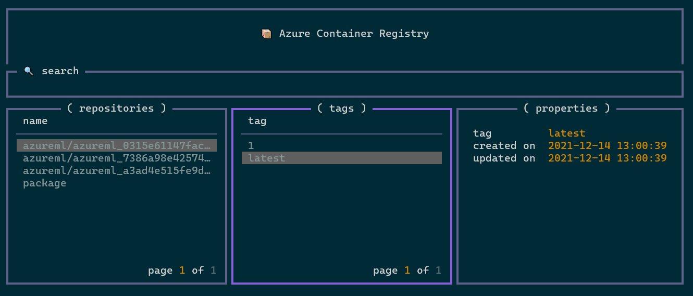

<!-- markdownlint-disable MD026 -->
[](https://badge.fury.io/py/azurecr-browser)
[](https://pypi.org/project/azurecr-browser/)

[](https://github.com/psf/black)

# Azure Container Registry Browser

A terminal-based user interface for managing container images and artifacts in Azure Container Registry.



## Installation

```bash
pip install azurecr-browser
```

Once the app is installed you can run the application from your terminal with the command:

```bash
acr
```

Alternatively, you can skip the above, and instead run with Docker:

```bash
docker run --rm -it --volume $HOME:/app --volume $HOME/.azure:/root/.azure ghcr.io/samdobson/azurecr-browser:latest
```

### Authentication

`azurecr-browser` uses the [Azure CLI](https://docs.microsoft.com/en-us/cli/azure/) for authentication. Before using the app, make sure that you have logged in and set your subscription.

```bash
az login
az account set --subscription "xxxxxxxx-xxxx-xxxx-xxxx-xxxxxxxxxxxxx"
```

### Configuration

On first run you will be asked for some information so that the app can build your configuration file.

You'll need to enter a valid Azure Container Registry name.

Alternatively you can create a config file at `~/.azurecr-browser.toml`:

```bash
# .acr-browser.toml

registry = ""
```

## Credits

:rocket: This project owes a huge debt of gratitude to the fantastic [Azure Key Vault Browser](https://github.com/chelnak/azure-keyvault-browser), from which it is forked, and of course, to the underlying technologies that make both of these projects possible: [textual](https://github.com/willmcgugan/textual) and [rich](https://github.com/willmcgugan/rich)!

## Contributing

If you would like to contribute to `azurecr-browser` head over to the [contributing guide](CONTRIBUTING.md) to find out more.
